<div align="center">



</div>

```text
                                              tushar@vancouver ───────────────────────────────────────
                                              . Role: ................... Data & AI Analyst @ Moldavite
               nZh*Wo*ZYu                     . Side.Quest: ................... AI @ Cerebramha
              U@$$$B#*##@*                    . Base: ........................... Vancouver, BC, Canada
              &$@oJuf)1fk$X                   . Education: ........ CIS Data Analytics, Douglas College
              #$ku>.   .)bz                   .
              Q&adQrifzt!ux                   . Languages.Programming: ................ Python, SQL, TS
              Yo0Xv0`:!. ><                   . Languages.Real: ........................ English, Hindi
              xoJ-rqt~   <<                   .
               Yommwx[[li                     . Stack.Data: ............. PySpark, ETL, EDA, Dashboards
                J&abCf]                       . Stack.AI: ................. Claude, LangChain, RAG, n8n
               [w8@BMqz]'fJ1                  . Stack.Agents: ........... MCP, Inngest, Tool Use, Evals
            )zq&$&wZQ)!,^UapqJu(              . Stack.ML: ............. PyTorch, LoRA, FinBERT, Qwen2.5
        |nCh&@$$$&L)~]>,zobbaa#bwOX1          . Stack.Web: ................. FastAPI, Next.js, Supabase
      )O#&W##WMM&@%p['|q*ohoo*ohaohqn         . Stack.CRM: ........................... Salesforce, Zoho
     )#%M#&*o*oao*##Wpa#hkbohoMaohkbpt        .
     0$&M#&Wo*ohak#k#bb*babohhWW#ahbdX        ─ Contact ──────────────────────────────────────────────
     *$&&&W%M%ooahoh*bh#kakkhhM@MakbbL        . Email: ................... tusharshandilya214@gmail.com
    t%B8WM#W%@MMoaoh*k#&aahkakB%aakbbq        . LinkedIn: ......................... tusharshandilya0421
    Y$&*ohhaB$B8&*o*Wa8%*#*oaaaY1]il+n(       . Portfolio: ................... tusharcreates.vercel.app
    Cqv(?>>]h$$$$%*%WoB8*#W8%w(~i<,  ,        . GitHub: ..................................... tushaarrr
    LOj?!'  YwppOmmaka8WW%%B0|j(-+i  !        .
    Jbz)>;l]nxvf^;l>+?[)ff|)~ii!ii`.;         ─ Receipts ─────────────────────────────────────────────
    naZv[<<-)(vkWbQXxjt(1]+~<~<>i!;,<         . Hours.Saved: ............................ 100+ / month
     dbOJzut[~<+[jXZaopZLJYcnnr(]<!~          . Records.Standardized: ........................... 150K+
     zhJvcczcuxxjttrYd8%Mokdqqdhd0Yf          . Conflicts.Caught: ....................... 104/104, 0 FP
      Lp0Cd**oahkbko#8@$$$$$$$$$d             . Macro.F1: ................................ 82.0 -> 85.7
          X8$$$$$$$$$$$@@$$$$$B#Y             . Agents.Shipped: ................ 15  |  Tests.In.CI: 400
```

```text
tushar@vancouver ~ % neofetch --profile

 now ·········· data & ai analyst @ moldavite
                co-founder @ cerebramha technologies
 ships ········ ai agents with approval gates — nothing sends without a human
 languages ···· python · sql · typescript
 backend ······ fastapi · flask · next.js · postgresql · supabase
 data ········· pyspark · etl · eda · dashboards · data quality · entity resolution
 ai ··········· claude · langchain · rag · pgvector · n8n · inngest · mcp
 ai eng ······· agent orchestration · tool use · structured outputs · evals & guardrails · human-in-the-loop
 ml ··········· pytorch · lora fine-tuning · finbert · distilbert · qwen2.5 · cnns
 crm ·········· salesforce · zoho · crm workflows & integrations
 cloud ········ aws (s3, ec2 gpu) · gcp · vercel · docker · github actions
 receipts ····· 50–60 hrs/month of manual work automated
                150k+ records standardized into analysis-ready datasets
                104/104 planted conflicts caught, 0 false positives
                macro-f1 82.0 → 85.7 by reading the error distribution
 education ···· post-bacc, computer information systems (data analytics) — douglas college
 location ····· vancouver, bc 🇨🇦
```

<div align="center">

[portfolio](https://tusharcreates.vercel.app) · [linkedin](https://linkedin.com/in/tusharshandilya0421) · [email](mailto:tusharshandilya214@gmail.com)

</div>

<br/>

## the forward pass

<div align="center">



<sub>how everything i build flows: raw data in, human-approved output out</sub>

</div>

<br/>

## tech stack

<div align="center">

**data & analytics**


**ai & agents**


**machine learning**


**software engineering**


**crm & automation**


**cloud & tooling**


</div>

<br/>

## selected work

| project | what it is | the number that matters |
|:--|:--|:--|
| [legalauto](https://github.com/tushaarrr/legalauto) | ai intake & screening agent for law firms — approval-first, nothing persists until a human signs off | 104/104 conflicts caught · 0% false positives · 2.2s per intake |
| [voice-agent](https://github.com/tushaarrr/Voice-AI-Agent-and-Conversational-Intelligence-System) | twilio voice agent, 3-tier cascade: deterministic match → gpt-4o-mini → human transfer | the common path never touches the model |
| [financial sentiment](https://github.com/tushaarrr/Financial-Sentiment-Intelligence-Full-Stack-AI-Dashboard-with-FinBERT-and-Qwen-LoRA) | finbert vs distilbert vs qwen2.5-lora benchmarking, served through a fastapi + next.js dashboard | macro-f1 82.0 → 85.7 |
| [voxelscan](https://github.com/tushaarrr/voxelscan-3d-defect-detection-inspection-reporting) | 3d scan defect detection with automated inspection reporting | raw voxels in, reviewable findings out |
| [claims analytics](https://github.com/tushaarrr/Insurance-Bordereaux-Claims-Analytics) | bordereaux insurance data — cleaned, standardized, reportable | messy in, portfolio-level insight out |
| [customer churn](https://github.com/tushaarrr/Customer_churn) | eda + modeling on churn signals | who leaves, when, and what predicts it |

<br/>

## stats

<div align="center">


</div>

<br/>

## the graph

<div align="center">

<picture>
  <source media="(prefers-color-scheme: dark)" srcset="https://raw.githubusercontent.com/tushaarrr/tushaarrr/output/github-snake.svg">
  
</picture>

</div>

<br/>

<div align="center">
<sub>the worst failure is the quiet one — nothing errors out, the output is just wrong.</sub>
</div>
